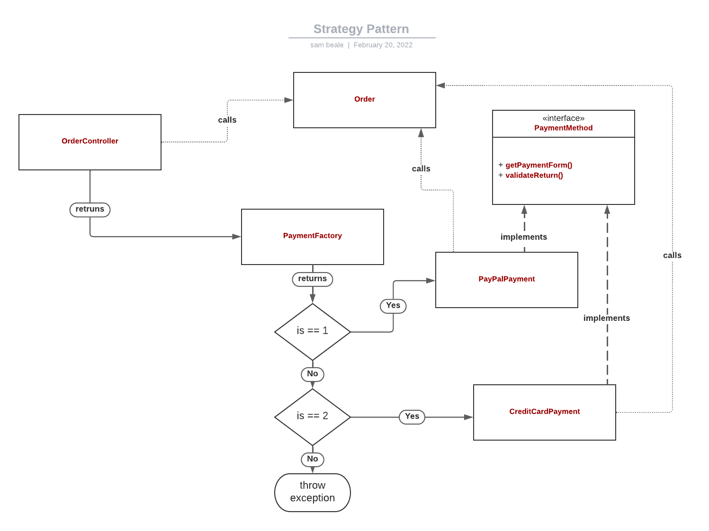

### The Strategy Pattern...
<ul>
    <li>
    Strategy is a behavioral design pattern that lets you define a family of algorithms, put each of them into a separate class, and make their objects interchangeable.
    </li>
    <li>
    The Strategy pattern is often used in PHP code, especially when it’s necessary to switch algorithms at runtime.
    </li>
</ul>

