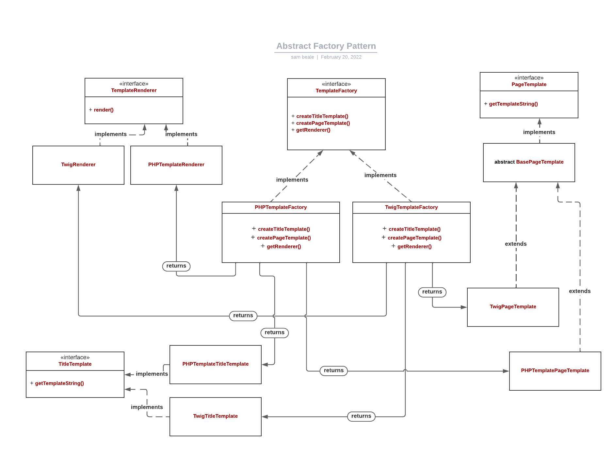

### The Abstract Factory...
<ul>
    <li>
    Abstract Factory defines an interface for creating all distinct products but leaves the actual product creation to concrete factory classes. Each factory type corresponds to a certain product variety.
    </li>
    <li>
    The client code calls the creation methods of a factory object instead of creating products directly with a constructor call (new operator). Since a factory corresponds to a single product variant, all its products will be compatible.
    </li>
</ul>

